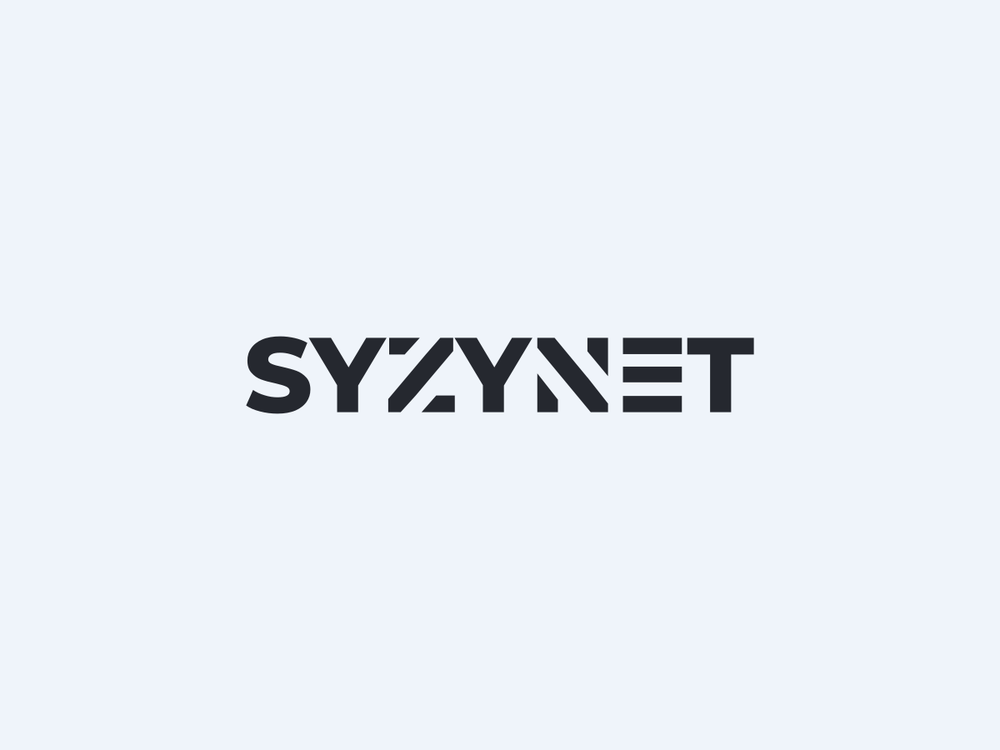

  

## About us
SyzyNet is a company based around Web Application Security founded in 2022. Any free software we make will always have it's code released as open source under our github!

Our Goal is to make obtaining tools and knowledge much easier for the general population, we wish to see everyone practicing and employing the best security techniques as painlessly as possible

We started out as a simple group developing cheats for VRChat, and decided to move on to bigger and better things.

## Our Members

### Top
Owner and Main Dev for SyzyNet, currently attending college and pursuing a BA in computer science

Contact information: 
 - Discord: tawp#0001
 - Email: Sutashisu@protonmail.com

### Fruit
Co-Owner and Financial Manager for SyzyNet, software exploitation as a hobby, resident femboy

## Looking for a carrer?
We are currently not hiring any new employee's, but once we get some more groundwork laid out and we are going in full force, make sure to check back with us and see if you meet the requirements to be employed with us!

If you are looking to volunteer or contribute, reach out to us with our contact email!

## Contact Us

All business inquiries should be sent to support@syzynet.co

